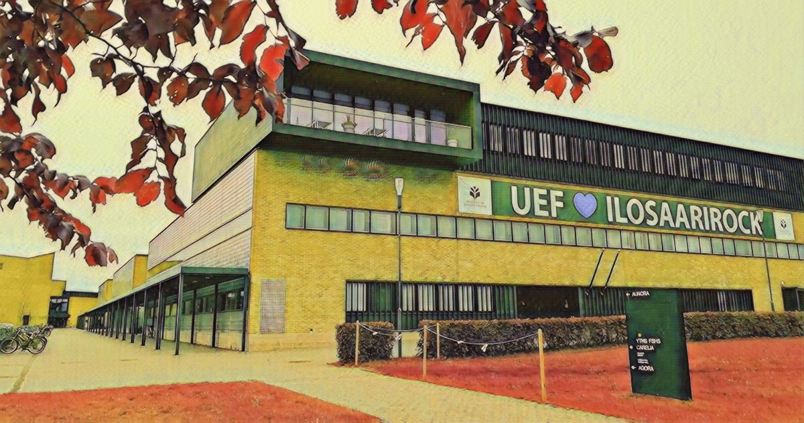
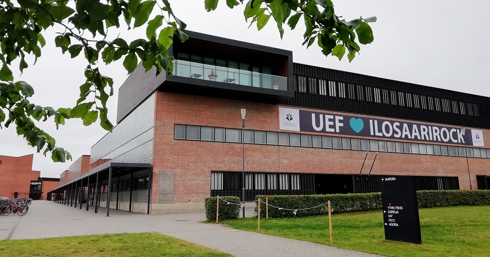

# CycleGAN-Finphot2Art

 

## First words
In this repository, I build and train a CycleGAN model from scratch, applying it to photos of landscapes from where I live in Joensuu, Finland. The goal is to create some amazing artwork.

## Usage
<details open>
<summary>Requirements</summary>
- Python3
- tqdm
- numpy
- matplotlib
- seaborn
- opencv-python
- torch
- torchvision
</details>

<details open>
<summary>Install</summary>

First, clone the repository.
```bash
git clone https://github.com/HoangPham3003/CycleGAN-Finphot2Art.git
cd CycleGAN-Finphot2Art
```
Second, create and activate the python environment.
```bash
python3 -m venv .venv
source .venv/bin/activate
```
Finally, install requirements.
```bash
pip install --upgrade pip
pip install -r requirements.txt
```
</details>

<details open>
<summary>Train</summary>

Default parameters:
```bash
python train.py
```\\
or you can freely adjust parameters (more information can be found at [train.py](https://github.com/HoangPham3003/CycleGAN-Finphot2Art/blob/a275c28a1179139707ad0d6fd7257964a94cb5d2/train.py#L19)):
```bash
python train.py -pt CycleGAN.pt -lr 0.0002 -ep 20 -bs 1 -ds 200 -ts 256 -d cuda -s True 
```
</details>
