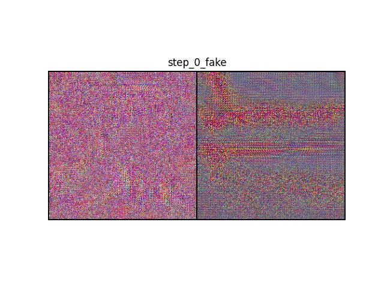
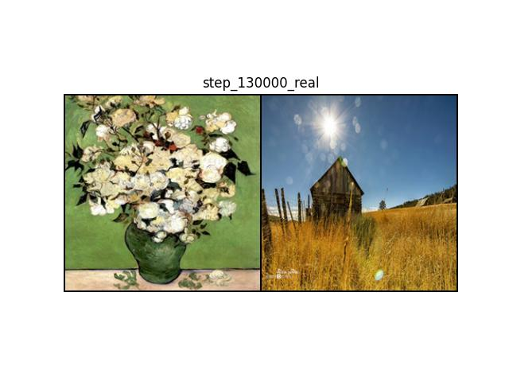

# CycleGAN-Finphot2Art

 

## First words
In this repository, I build and train a CycleGAN model from scratch, applying it to photos of landscapes from where I live in Joensuu, Finland. The goal is to create some amazing artwork.

## Requirements
<ul>
<li>Python3</li>
<li>tqdm</li>
<li>numpy</li>
<li>matplotlib</li>
<li>seaborn</li>
<li>opencv-python</li>
<li>torch</li>
<li>torchvision</li>
</ul>

## Install

First, clone the repository.
```bash
git clone https://github.com/HoangPham3003/CycleGAN-Finphot2Art.git
cd CycleGAN-Finphot2Art
```
Second, create and activate the python environment.
```bash
python3 -m venv .venv
source .venv/bin/activate
```
Finally, install requirements.
```bash
pip install --upgrade pip
pip install -r requirements.txt
```

## Train
Default parameters <br>
To start training with the default parameters, run: <br>
```bash
python train.py
```

Custom parameters <br>
To customize training, you can adjust the parameters as follows: <br>
```bash
python train.py -pt CycleGAN.pt -lr 0.0002 -ep 20 -bs 1 -ds 200 -ts 256 -d cuda -s True 
```
For a detailed explanation of the training parameters, refer to the [train.py](https://github.com/HoangPham3003/CycleGAN-Finphot2Art/blob/main/train.py)

## Infer
To generate a new artwork from a photo: <br>
```bash
python infer.py -pt CycleGAN.pt -ip img1.jpg -sd inference -d cuda
```
For a detailed explanation of the inference parameters, refer to the [infer.py](https://github.com/HoangPham3003/CycleGAN-Finphot2Art/blob/main/infer.py)

## Results
In this experiment, I use the [vangogh2photo](http://efrosgans.eecs.berkeley.edu/cyclegan/dataset/vangogh2photo.zip) dataset for training. More dataset (cityscapes, horse2zebra, maps, monet2photo,...) can be found at [here](http://efrosgans.eecs.berkeley.edu/cyclegan/datasets/).The model is trained for 20 epochs with a batch size of 1, resulting in a total of 130,000 steps.
<ul>
  <li>First, I examine the generator and discriminator losses:</li>
  
  
  <li>Second, I review the fake and real images at some steps.</li>
  
  
  
  
  
  
  
</ul>

## Methodology
A detailed explanation of the proposed method can be found in the official CycleGAN paper [Unpaired Image-to-Image Translation using Cycle-Consistent Adversarial Networks](https://arxiv.org/pdf/1703.10593)

## Acknowledgements
Very thanks to authors who have implementations of CycleGAN:
1. [Official CycleGAN by @junyanz](https://github.com/junyanz/pytorch-CycleGAN-and-pix2pix)
2. [CycleGAN in pytorch by @aitorzip](https://github.com/aitorzip/PyTorch-CycleGAN/tree/master)
3. [GAN specialization tutorial by Coursera](https://www.coursera.org/specializations/generative-adversarial-networks-gans)


